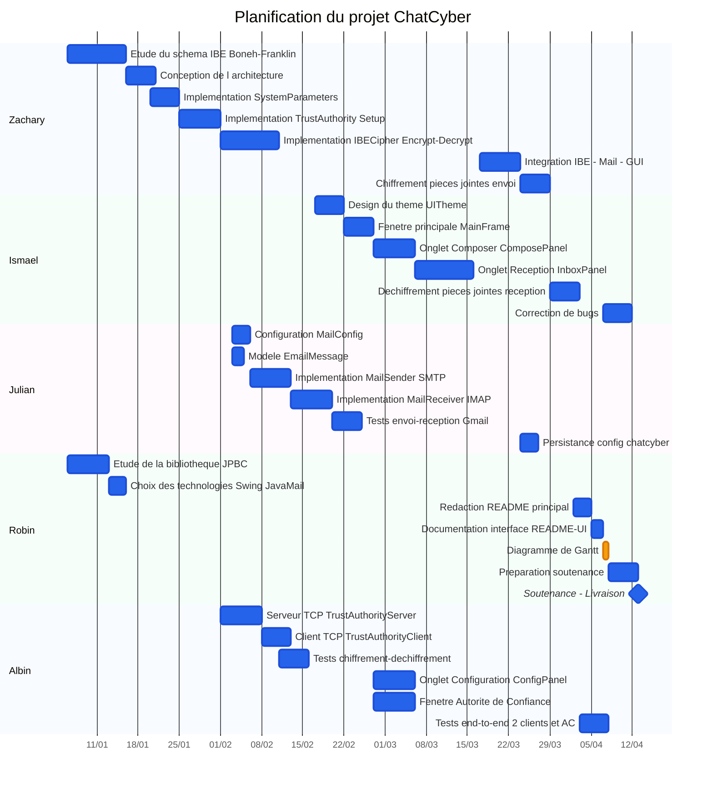

# ChatCyber — Diagramme de Gantt du projet

> Chaque section = une personne = une couleur distincte.

## Répartition par membre

| Membre | Rôle principal | Tâches clés |
|--------|---------------|-------------|
| **Zachary** | Cryptographie IBE | SystemParameters, TrustAuthority, IBECipher, intégration, chiffrement envoi |
| **Ismael** | Interface graphique | UITheme, MainFrame, ComposePanel, InboxPanel, déchiffrement réception, bugs |
| **Julian** | Messagerie email | MailConfig, MailSender, MailReceiver, EmailMessage, tests mail, persistance |
| **Robin** | Recherche & Documentation | Étude JPBC, choix technos, README, README-UI, Gantt, soutenance |
| **Albin** | Réseau & Tests | TrustAuthorityServer/Client, ConfigPanel, TrustAuthorityFrame, tests E2E |