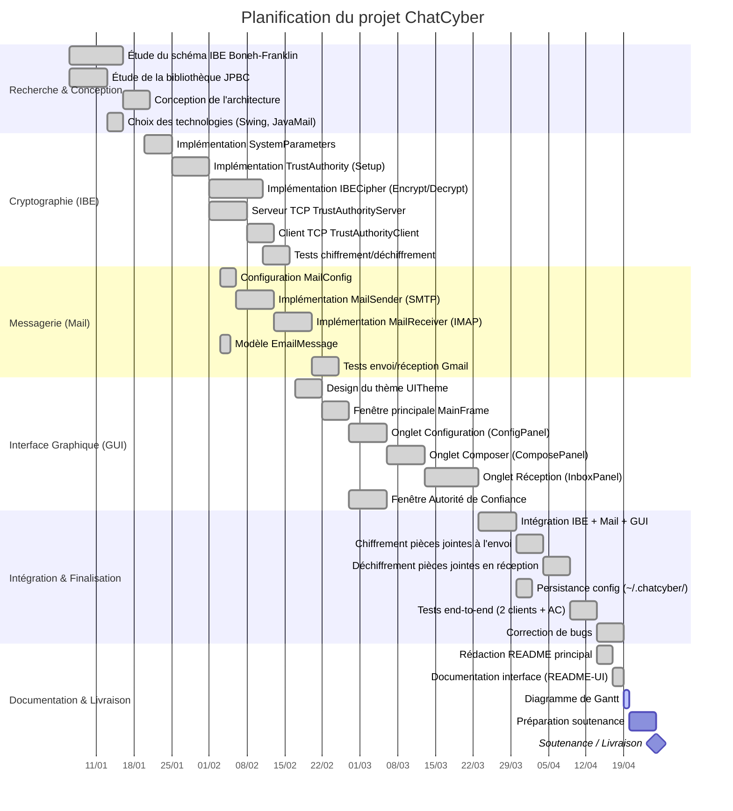

# ChatCyber — Diagramme de Gantt du projet

```mermaid
gantt
    title Planification du projet ChatCyber
    dateFormat  YYYY-MM-DD
    axisFormat  %d/%m

    section Recherche & Conception
    Étude du schéma IBE Boneh-Franklin       :done, r1, 2026-01-06, 10d
    Étude de la bibliothèque JPBC            :done, r2, 2026-01-06, 7d
    Conception de l'architecture              :done, r3, after r1, 5d
    Choix des technologies (Swing, JavaMail)  :done, r4, 2026-01-13, 3d

    section Cryptographie (IBE)
    Implémentation SystemParameters           :done, c1, 2026-01-20, 5d
    Implémentation TrustAuthority (Setup)     :done, c2, after c1, 7d
    Implémentation IBECipher (Encrypt/Decrypt):done, c3, after c2, 10d
    Serveur TCP TrustAuthorityServer          :done, c4, after c2, 7d
    Client TCP TrustAuthorityClient           :done, c5, after c4, 5d
    Tests chiffrement/déchiffrement           :done, c6, after c3, 5d

    section Messagerie (Mail)
    Configuration MailConfig                  :done, m1, 2026-02-03, 3d
    Implémentation MailSender (SMTP)          :done, m2, after m1, 7d
    Implémentation MailReceiver (IMAP)        :done, m3, after m2, 7d
    Modèle EmailMessage                       :done, m4, 2026-02-03, 2d
    Tests envoi/réception Gmail               :done, m5, after m3, 5d

    section Interface Graphique (GUI)
    Design du thème UITheme                   :done, g1, 2026-02-17, 5d
    Fenêtre principale MainFrame              :done, g2, after g1, 5d
    Onglet Configuration (ConfigPanel)        :done, g3, after g2, 7d
    Onglet Composer (ComposePanel)            :done, g4, after g3, 7d
    Onglet Réception (InboxPanel)             :done, g5, after g4, 10d
    Fenêtre Autorité de Confiance             :done, g6, after g2, 7d

    section Intégration & Finalisation
    Intégration IBE + Mail + GUI              :done, i1, after g5, 7d
    Chiffrement pièces jointes à l'envoi      :done, i2, after i1, 5d
    Déchiffrement pièces jointes en réception :done, i3, after i2, 5d
    Persistance config (~/.chatcyber/)        :done, i4, after i1, 3d
    Tests end-to-end (2 clients + AC)         :done, i5, after i3, 5d
    Correction de bugs                        :done, i6, after i5, 5d

    section Documentation & Livraison
    Rédaction README principal                :done, d1, after i5, 3d
    Documentation interface (README-UI)       :done, d2, after d1, 2d
    Diagramme de Gantt                        :active, d3, after d2, 1d
    Préparation soutenance                    :d4, after d3, 5d
    Soutenance / Livraison                    :milestone, d5, after d4, 0d
```