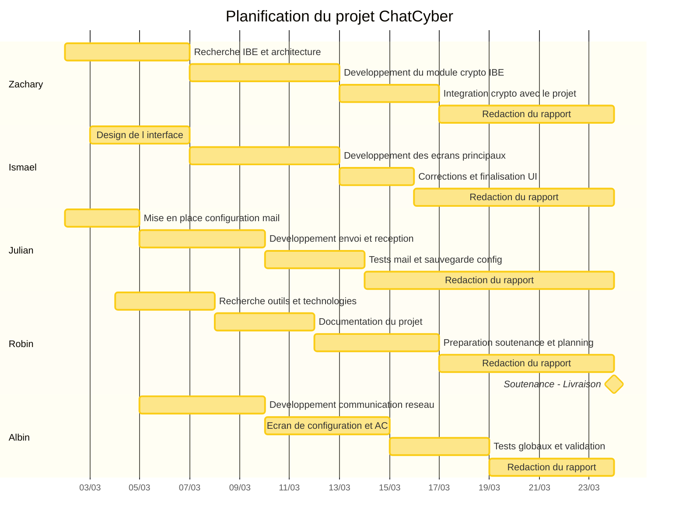

# ChatCyber — Diagramme de Gantt du projet

> Chaque section = une personne = une couleur distincte.

## Répartition par membre

| Membre | Rôle principal | Tâches clés |
|--------|---------------|-------------|
| **Zachary** | Cryptographie IBE | Recherche IBE, développement crypto, intégration |
| **Ismael** | Interface graphique | Design UI, écrans principaux, corrections |
| **Julian** | Messagerie email | Configuration mail, envoi/réception, tests |
| **Robin** | Recherche & Documentation | Recherche techno, documentation, soutenance |
| **Albin** | Réseau & Tests | Communication réseau, configuration AC, validation globale |